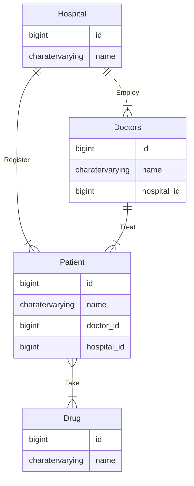

# Spring Boot Application Readme

This readme provides an overview of a Spring Boot application that includes four entities: Hospital, Doctor, Drug, and Patient. The application provides RESTful APIs to manage these entities through corresponding controllers. The application is built using JDK 20 and can be deployed in a Docker container.

## Entity Relationship Diagram(ERD)


=======

<p align="center"></p>

## Entities

### Hospital
- Represents a hospital entity.
- Contains properties such as id, name.

### Doctor
- Represents a doctor entity.
- Contains properties such as id, name,hospital_id.

### Drug
- Represents a drug entity.
- Contains properties such as id, name,hospital_id,doctor_id.

### Patient
- Represents a patient entity.
- Contains properties such as id, name.

## Controllers

### HospitalController
- REST controller for managing hospitals.
- Base URL: `/hospitals`

#### Endpoints:
- `GET /list`: Retrieves a list of all hospitals.
- `GET /{id}`: Retrieves a specific hospital by ID.
- `POST /add`: Adds a new hospital.
- `POST /delete/{id}`: Deletes a hospital with the specified ID.
- `POST /update/{id}`: Updates a hospital with the specified ID.
- `GET /search?name={name}`: Searches for hospitals by name.

### DoctorController
- REST controller for managing doctors.
- Base URL: `/doctors`

#### Endpoints:
- `GET /list`: Retrieves a list of all doctors.
- `GET /{id}`: Retrieves a specific doctor by ID.
- `POST /add`: Adds a new doctor.
- `POST /delete/{id}`: Deletes a doctor with the specified ID.
- `POST /update/{id}`: Updates a doctor with the specified ID.
- `GET /search?name={name}`: Searches for doctors by name.

### PatientController
- REST controller for managing patients.
- Base URL: `/patients`

#### Endpoints:
- `GET /list`: Retrieves a list of all patients.
- `GET /{id}`: Retrieves a specific patient by ID.
- `POST /add`: Adds a new patient.
- `POST /delete/{id}`: Deletes a patient with the specified ID.
- `POST /update/{id}`: Updates a patient with the specified ID.
- `GET /search?name={name}`: Searches for patients by name.

### DrugController
- REST controller for managing drugs.
- Base URL: `/drugs`

#### Endpoints:
- `GET /list`: Retrieves a list of all drugs.
- `GET /{id}`: Retrieves a specific drug by ID.
- `POST /add`: Adds a new drug.
- `POST /delete/{id}`: Deletes a drug with the specified ID.
- `POST /update/{id}`: Updates a drug with the specified ID.
- `GET /search?name={name}`: Searches for drugs by name.

## Deployment

To deploy the application, follow these steps:

1. Ensure you have JDK 20 installed.
2. Build the application using a build tool like Maven or Gradle.
3. Create a Dockerfile with the following content:

```Dockerfile
FROM openjdk:20-oracle
COPY target/*.jar healthapp.jar
EXPOSE 9090
ENTRYPOINT ["java","-jar","healthapp.jar"]
```

4. Build the Docker image by running the following command in the terminal:

```bash
docker build -t healthapp .
```

5. Run a PostgreSQL container or have it already running. Make sure to configure the application's database connection properties accordingly.
6. Run the Spring Boot application inside a Docker container:

```bash
docker run -d -p 5432:5432 -e POSTGRES_PASSWORD=password -e POSTGRES_USER=username -e POSTGRES_DB=dbname -v C:\postgres_container_data:/var/lib/postgresql/data --name=containername postgres```

Note: Replace `password` with the password of your PostgreSQL.

Note: Replace `username` with the username of your PostgreSQL.

Note: Replace `dbname` with the database name of your PostgreSQL.

The application should now be running and accessible at `http://localhost:9090`.

Feel free to customize the application's configuration and adapt it to your specific needs.

## Dependencies

The application depends on the following:
- Spring Boot framework
- PostgreSQL database (container)
- Docker

Ensure that you have these dependencies installed and configured correctly.
